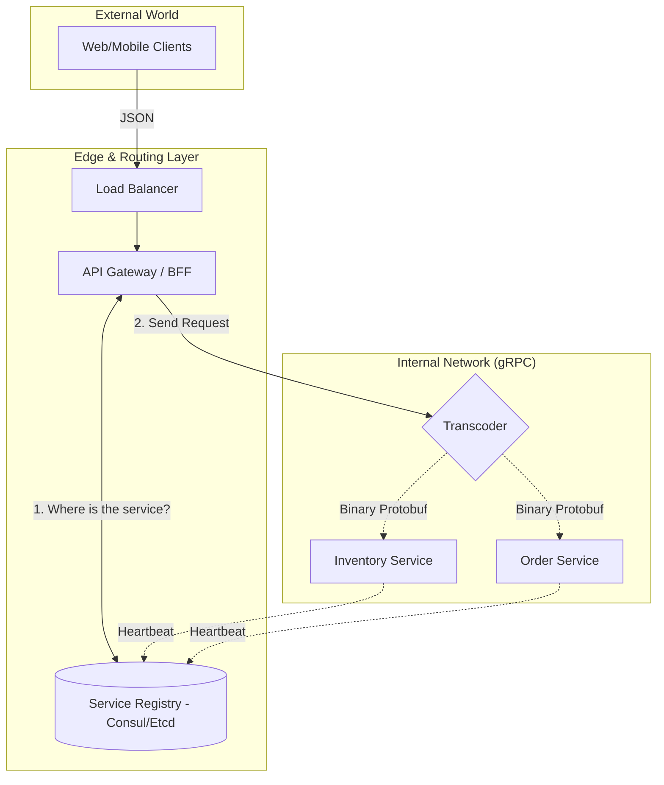

## 🚄 Deep Dive: gRPC (The Internal Backbone)

While the public interacts with services via **REST (JSON over HTTP/1.1)**, internal microservices almost exclusively use **gRPC** (Google Remote Procedure Call). 

### The Core Technology: Protocol Buffers (Protobuf)
Instead of sending human-readable JSON strings, gRPC uses **Protocol Buffers**, a binary serialization format.

* **Binary vs Text:** JSON is bulky. Protobuf is packed into a compact binary format, making it 3x to 10x smaller and significantly faster to serialize/deserialize.
* **Strong Typing:** You define your data structure in a `.proto` file. Both the client and server code are generated from this file, eliminating "contract mismatch" bugs.

### Why gRPC uses HTTP/2
gRPC relies on **HTTP/2** as its transport layer to enable:
1.  **Bidirectional Streaming:** Client and server can send a stream of messages simultaneously.
2.  **Multiplexing:** Many calls over a single connection.
3.  **Header Compression (HPACK):** Reducing the overhead of repetitive metadata.

---

## 📊 gRPC vs. REST: The Staff Perspective

| Feature | REST | gRPC |
| :--- | :--- | :--- |
| **Protocol** | HTTP/1.1 (usually) | HTTP/2 |
| **Payload** | JSON (Text) | Protobuf (Binary) |
| **Contract** | Loose (OpenAPI/Swagger optional) | Strict (`.proto` file mandatory) |
| **Streaming** | Client -> Server only | Bidirectional, Client-side, Server-side |
| **Browser Support** | Native | Limited (requires `grpc-web` proxy) |

### Real-World Architecture: The "BFF" Pattern
In a flash sale or high-scale system, we use a **BFF (Backend for Frontend)** or an **API Gateway**.

1.  **The Edge:** The Mobile App/Browser talks to the Gateway using **REST/JSON** (easier for browsers/public).
2.  **The Core:** The Gateway translates that request into **gRPC** to talk to the internal "Inventory" and "Order" services.
3.  **The Benefit:** This maximizes speed where it matters (the "Chatty" internal network) while maintaining compatibility with the public internet.

---

### Staff Interview Pro-Tip: "When NOT to use gRPC"
If an interviewer asks if gRPC is always better, provide a nuanced answer:
*"gRPC is superior for performance and internal contracts. However, it is **harder to debug** (you can't just read the binary traffic in a network sniffer as easily as JSON) and has **poor browser support**. If you are building a public-facing API for third-party developers, REST is still the industry standard for ease of adoption."*

---

## 🔍 Deep Dive: Service Discovery

In a modern cloud-native environment (Kubernetes/AWS), server instances are ephemeral—they spin up and die constantly, and their IP addresses change. **Service Discovery** is the mechanism that allows microservices to find each other.

### 1. The Two Main Patterns

#### A. Client-Side Discovery
The client is responsible for looking up the service's location.
* **How it works:** The client queries a **Service Registry** (like **Consul**, **Eureka**, or **Etcd**), gets a list of healthy IPs, and uses a local load-balancing algorithm to pick one.
* **Pros:** Direct communication (lower latency).
* **Cons:** The client needs logic for discovery and load balancing (often via a "Service Mesh" like Istio).

#### B. Server-Side Discovery (The Standard)
The client talks to a Load Balancer or Proxy.
* **How it works:** The client sends a request to a stable endpoint (e.g., `inventory-service.prod`). A Load Balancer (like **NGINX**, **AWS ALB**, or **Kubernetes Service**) queries the registry and routes the traffic.
* **Pros:** Simple for the client; the "Service" identity is abstracted.
* **Cons:** Adds an extra network hop.

---

### 2. The Heartbeat & Health Checks
A Service Registry is only useful if it’s accurate.
1.  **Registration:** When a service starts, it registers its IP with the registry.
2.  **Heartbeat:** The service sends a periodic "I am alive" signal.
3.  **Deregistration:** If the heartbeat stops, the registry removes the IP so no more traffic is sent to a dead node.

---

### 3. Service Mesh: The Staff Move (Istio/Linkerd)
As your architecture grows to hundreds of gRPC services, managing discovery, retries, and security in code becomes impossible. We use a **Service Mesh**.

* **The Sidecar Pattern:** We deploy a tiny proxy (like **Envoy**) alongside every service container.
* **The Benefit:** The application code doesn't know about gRPC load balancing or retries. It just talks to `localhost`, and the **Sidecar** handles discovery, mTLS encryption, and circuit breaking.

---

### 📊 Service Discovery Comparison

| Feature | DNS-based (Basic) | Service Registry (Consul) | Service Mesh (Istio) |
| :--- | :--- | :--- | :--- |
| **Speed** | Slow (TTL propagation issues) | Fast (Real-time updates) | Fast (Sidecar routing) |
| **Intelligence** | Low (Round Robin) | Medium (Health awareness) | High (Traffic splitting/Canary) |
| **Complexity** | Very Low | Moderate | High |

---

### Staff Interview Pro-Tip: "The Zookeeper/Etcd Consistency Problem"
In a Staff interview, remember that the **Service Registry** itself must be highly available and consistent.
*"If the Service Registry goes down, the entire cluster goes blind. That's why tools like **Etcd** (used by Kubernetes) use the **Raft Consensus Algorithm** to ensure that even if a node fails, the service list remains consistent across the remaining nodes."*

# 🔄 Transcoding: The JSON to Binary Protobuf Boundary

In a Staff-level architecture, the conversion between human-readable JSON and efficient Binary Protobuf happens at the **Interface Boundary**. This ensures that the external world (Browsers/Mobile) stays flexible while the internal world (Microservices) stays fast.

---

## 📍 Where does the "Parser" live?

Depending on your system design, this "transcoder" fits into one of two primary locations:

### 1. In the API Gateway / BFF (Most Common)
When you have a public-facing app, the browser cannot natively speak gRPC efficiently. The **API Gateway** acts as the translator.

**The Flow:**
1.  **Request:** The Client sends a `POST /order` with a **JSON** body.
2.  **Mapping:** The Gateway receives the JSON and maps the fields to a generated Protobuf class.
3.  **Serialization:** The Gateway **serializes** that object into a **Binary Buffer**.
4.  **Transport:** The Gateway sends that binary payload over an **HTTP/2** stream to the internal microservice.

### 2. In the Application "Sidecar" (Service Mesh)
If you are using a Service Mesh like **Istio (Envoy)**, you can offload this translation to the sidecar proxy.

* **How it works:** Proxies like Envoy support a **"JSON-to-gRPC transcoding"** filter. Your application code can send/receive simple JSON to its local proxy (via localhost), and the proxy handles the heavy lifting of binary packing/unpacking before the data ever leaves the host.

---

## 🧱 Where the Code Lives: The "Stub" vs. "Skeleton"

The "parsing" logic is usually hidden inside the **Generated Code** (e.g., `inventory_pb2.py` in Python). It operates across three distinct layers:

1.  **Application Layer:** You work with a native language object (e.g., `request = StockRequest(id='123')`).
2.  **Protobuf Library (The Parser):** When the RPC is called, the library iterates through the object fields and converts them into a wire-format binary stream ($O(N)$ complexity).
3.  **Transport Layer (HTTP/2):** The resulting binary stream is chopped into frames and sent over the wire.

---

## 📊 Performance Comparison: Why we parse to Binary

| Format | Parsing Method | Bottleneck |
| :--- | :--- | :--- |
| **JSON** | **String Scanning & Tokenizing:** The parser must look for quotes, braces, and escape characters. | **CPU Bound:** Text parsing is computationally expensive and slow at scale. |
| **Protobuf** | **Binary Offset Reading:** The parser uses field tags and lengths to skip exactly to the data it needs. | **Memory Bound:** The CPU does very little work; it's mostly waiting for data to move from RAM. |

---

## 💡 Staff Interview Pro-Tip: "Zero-Copy Deserialization"

If you want to demonstrate deep expertise, mention **FlatBuffers** or **Cap'n Proto**.

> *"While Protobuf is fast, it still requires a 'parse' step to turn the binary wire format into a memory-resident object. Tools like **Cap'n Proto** use a memory layout that is identical on the wire as it is in RAM. This allows for **Zero-Copy access**, where the application can read data directly from the buffer without any deserialization step at all. This is a game-changer for ultra-low latency systems like High-Frequency Trading (HFT)."*

### 🏗️ Service Layer Architecture Diagram

This table summarizes the core components of a modern, gRPC-backed microservices architecture. It highlights the transition from public-facing protocols to high-performance internal communication.

| Component | Responsibility | Protocol |
| :--- | :--- | :--- |
| **Edge Layer** | Authentication, Rate Limiting, and SSL Termination. | HTTP/1.1 or HTTP/2 |
| **API Gateway** | Aggregates multiple service calls (BFF pattern) into one response. | JSON (External) |
| **Transcoder** | Converts incoming JSON payloads into Binary Protobuf objects. | JSON $\rightarrow$ Protobuf |
| **gRPC Services** | High-performance internal business logic and inter-service talk. | HTTP/2 + Protobuf |
| **Service Registry** | Maintains a real-time list of healthy service IP addresses. | Raft / Gossip |
| **Observability** | Tracks metrics (Prometheus) and distributed traces (Jaeger). | AP Protocol |

---

### 💡 Staff-Level Architectural Notes

* **The Transition Point:** The **Transcoder** is the most CPU-intensive part of the Edge layer. In high-traffic systems (like Flash Sales), this is often offloaded to a **Sidecar Proxy** (Envoy) to keep the application code clean.
* **The Protocol Choice:** We use **Raft/Gossip** for the Service Registry because it must be **CP** (Consistent). If the registry gives an incorrect IP, the gRPC call fails immediately.
* **The Observability Trade-off:** We use **AP** (Available) protocols for monitoring. It is better to lose a few trace spans than to have the logging system slow down the actual production traffic.

    