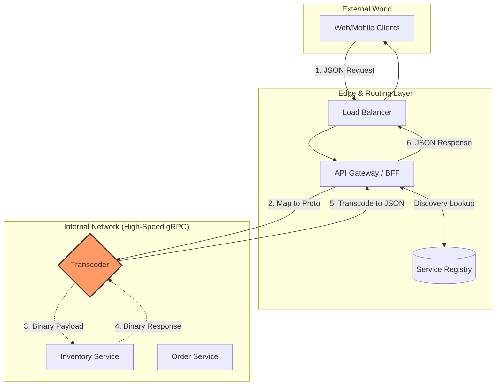

## 🚄 Deep Dive: gRPC (The Internal Backbone)

While the public interacts with services via **REST (JSON over HTTP/1.1)**, internal microservices almost exclusively use **gRPC** (Google Remote Procedure Call). 

### The Core Technology: Protocol Buffers (Protobuf)
Instead of sending human-readable JSON strings, gRPC uses **Protocol Buffers**, a binary serialization format.

* **Binary vs Text:** JSON is bulky. Protobuf is packed into a compact binary format, making it 3x to 10x smaller and significantly faster to serialize/deserialize.
* **Strong Typing:** You define your data structure in a `.proto` file. Both the client and server code are generated from this file, eliminating "contract mismatch" bugs.

### Why gRPC uses HTTP/2
gRPC relies on **HTTP/2** as its transport layer to enable:
1.  **Bidirectional Streaming:** Client and server can send a stream of messages simultaneously.
2.  **Multiplexing:** Many calls over a single connection.
3.  **Header Compression (HPACK):** Reducing the overhead of repetitive metadata.

---

## 📊 gRPC vs. REST: The Staff Perspective

| Feature | REST | gRPC |
| :--- | :--- | :--- |
| **Protocol** | HTTP/1.1 (usually) | HTTP/2 |
| **Payload** | JSON (Text) | Protobuf (Binary) |
| **Contract** | Loose (OpenAPI/Swagger optional) | Strict (`.proto` file mandatory) |
| **Streaming** | Client -> Server only | Bidirectional, Client-side, Server-side |
| **Browser Support** | Native | Limited (requires `grpc-web` proxy) |

### Real-World Architecture: The "BFF" Pattern
In a flash sale or high-scale system, we use a **BFF (Backend for Frontend)** or an **API Gateway**.

1.  **The Edge:** The Mobile App/Browser talks to the Gateway using **REST/JSON** (easier for browsers/public).
2.  **The Core:** The Gateway translates that request into **gRPC** to talk to the internal "Inventory" and "Order" services.
3.  **The Benefit:** This maximizes speed where it matters (the "Chatty" internal network) while maintaining compatibility with the public internet.

---

### Staff Interview Pro-Tip: "When NOT to use gRPC"
If an interviewer asks if gRPC is always better, provide a nuanced answer:
*"gRPC is superior for performance and internal contracts. However, it is **harder to debug** (you can't just read the binary traffic in a network sniffer as easily as JSON) and has **poor browser support**. If you are building a public-facing API for third-party developers, REST is still the industry standard for ease of adoption."*

---

## 🔍 Deep Dive: Service Discovery

In a modern cloud-native environment (Kubernetes/AWS), server instances are ephemeral—they spin up and die constantly, and their IP addresses change. **Service Discovery** is the mechanism that allows microservices to find each other.

### 1. The Two Main Patterns

#### A. Client-Side Discovery
The client is responsible for looking up the service's location.
* **How it works:** The client queries a **Service Registry** (like **Consul**, **Eureka**, or **Etcd**), gets a list of healthy IPs, and uses a local load-balancing algorithm to pick one.
* **Pros:** Direct communication (lower latency).
* **Cons:** The client needs logic for discovery and load balancing (often via a "Service Mesh" like Istio).

#### B. Server-Side Discovery (The Standard)
The client talks to a Load Balancer or Proxy.
* **How it works:** The client sends a request to a stable endpoint (e.g., `inventory-service.prod`). A Load Balancer (like **NGINX**, **AWS ALB**, or **Kubernetes Service**) queries the registry and routes the traffic.
* **Pros:** Simple for the client; the "Service" identity is abstracted.
* **Cons:** Adds an extra network hop.

---

### 2. The Heartbeat & Health Checks
A Service Registry is only useful if it’s accurate.
1.  **Registration:** When a service starts, it registers its IP with the registry.
2.  **Heartbeat:** The service sends a periodic "I am alive" signal.
3.  **Deregistration:** If the heartbeat stops, the registry removes the IP so no more traffic is sent to a dead node.

---

### 3. Service Mesh: The Staff Move (Istio/Linkerd)
As your architecture grows to hundreds of gRPC services, managing discovery, retries, and security in code becomes impossible. We use a **Service Mesh**.

* **The Sidecar Pattern:** We deploy a tiny proxy (like **Envoy**) alongside every service container.
* **The Benefit:** The application code doesn't know about gRPC load balancing or retries. It just talks to `localhost`, and the **Sidecar** handles discovery, mTLS encryption, and circuit breaking.

---

### 📊 Service Discovery Comparison

| Feature | DNS-based (Basic) | Service Registry (Consul) | Service Mesh (Istio) |
| :--- | :--- | :--- | :--- |
| **Speed** | Slow (TTL propagation issues) | Fast (Real-time updates) | Fast (Sidecar routing) |
| **Intelligence** | Low (Round Robin) | Medium (Health awareness) | High (Traffic splitting/Canary) |
| **Complexity** | Very Low | Moderate | High |

---

### Staff Interview Pro-Tip: "The Zookeeper/Etcd Consistency Problem"
In a Staff interview, remember that the **Service Registry** itself must be highly available and consistent.
*"If the Service Registry goes down, the entire cluster goes blind. That's why tools like **Etcd** (used by Kubernetes) use the **Raft Consensus Algorithm** to ensure that even if a node fails, the service list remains consistent across the remaining nodes."*

# 🔄 Transcoding: The JSON to Binary Protobuf Boundary

In a Staff-level architecture, the conversion between human-readable JSON and efficient Binary Protobuf happens at the **Interface Boundary**. This ensures that the external world (Browsers/Mobile) stays flexible while the internal world (Microservices) stays fast.

---

## 📍 Where does the "Parser" live?

Depending on your system design, this "transcoder" fits into one of two primary locations:

### 1. In the API Gateway / BFF (Most Common)
When you have a public-facing app, the browser cannot natively speak gRPC efficiently. The **API Gateway** acts as the translator.

**The Flow:**
1.  **Request:** The Client sends a `POST /order` with a **JSON** body.
2.  **Mapping:** The Gateway receives the JSON and maps the fields to a generated Protobuf class.
3.  **Serialization:** The Gateway **serializes** that object into a **Binary Buffer**.
4.  **Transport:** The Gateway sends that binary payload over an **HTTP/2** stream to the internal microservice.

### 2. In the Application "Sidecar" (Service Mesh)
If you are using a Service Mesh like **Istio (Envoy)**, you can offload this translation to the sidecar proxy.

* **How it works:** Proxies like Envoy support a **"JSON-to-gRPC transcoding"** filter. Your application code can send/receive simple JSON to its local proxy (via localhost), and the proxy handles the heavy lifting of binary packing/unpacking before the data ever leaves the host.

---

## 🧱 Where the Code Lives: The "Stub" vs. "Skeleton"

The "parsing" logic is usually hidden inside the **Generated Code** (e.g., `inventory_pb2.py` in Python). It operates across three distinct layers:

1.  **Application Layer:** You work with a native language object (e.g., `request = StockRequest(id='123')`).
2.  **Protobuf Library (The Parser):** When the RPC is called, the library iterates through the object fields and converts them into a wire-format binary stream ($O(N)$ complexity).
3.  **Transport Layer (HTTP/2):** The resulting binary stream is chopped into frames and sent over the wire.

---

## 📊 Performance Comparison: Why we parse to Binary

| Format | Parsing Method | Bottleneck |
| :--- | :--- | :--- |
| **JSON** | **String Scanning & Tokenizing:** The parser must look for quotes, braces, and escape characters. | **CPU Bound:** Text parsing is computationally expensive and slow at scale. |
| **Protobuf** | **Binary Offset Reading:** The parser uses field tags and lengths to skip exactly to the data it needs. | **Memory Bound:** The CPU does very little work; it's mostly waiting for data to move from RAM. |

---

## 💡 Staff Interview Pro-Tip: "Zero-Copy Deserialization"

If you want to demonstrate deep expertise, mention **FlatBuffers** or **Cap'n Proto**.

> *"While Protobuf is fast, it still requires a 'parse' step to turn the binary wire format into a memory-resident object. Tools like **Cap'n Proto** use a memory layout that is identical on the wire as it is in RAM. This allows for **Zero-Copy access**, where the application can read data directly from the buffer without any deserialization step at all. This is a game-changer for ultra-low latency systems like High-Frequency Trading (HFT)."*

### 🏗️ Service Layer Architecture Diagram

## 🔄 Bidirectional Transcoding: The Request-Response Loop

In high-scale architectures, the **Transcoder** acts as a two-way translator. It ensures that the internal network remains as fast as possible while the public API remains compatible with standard web tools.

| Direction | Action | Data Transformation |
| :--- | :--- | :--- |
| **Inbound (Request)** | **Encoding** | Client JSON $\rightarrow$ Binary Protobuf |
| **Outbound (Response)** | **Decoding** | Binary Protobuf $\rightarrow$ Client JSON |

---

### 💡 Staff Engineering Insight: The Cost of Serialization
While gRPC is fast, the act of transcoding at the edge introduces latency. 

* **Inbound (CPU Bound):** Parsing JSON strings is expensive because the CPU must scan for delimiters (`{`, `:`, `"`) and handle character escaping.
* **Outbound (Memory Bound):** Converting binary back to JSON requires the creation of many small string objects, which can increase **Garbage Collection (GC) pressure** in languages like Java, Go, or Python.

> **Optimization Tip:** To reduce this overhead, Staff Engineers often implement **Field Masks**, where the client specifies exactly which fields they need, allowing the transcoder to skip unnecessary data transformation.

---

## 🧱 Where the "Outgoing" Conversion Happens

The return path (Response) is just as critical as the request path. It follows a specific sequence to move data from a high-performance internal state back to a client-friendly format.

1.  **The Service Logic:** The internal service (e.g., Inventory) completes its task and returns a **Protobuf object**. At this stage, the data is still small, binary, and highly efficient for internal network travel.
2.  **The Transcoder's Role:** * It receives the binary buffer from the gRPC call.
    * It uses **Reflection APIs** or the **Generated Code** (`.pb.py`, `.pb.go`, etc.) to map binary tags back to human-readable field names (e.g., Tag `1` is mapped back to `"stock_count"`).
    * It serializes this mapping into a standard JSON string.
3.  **The Gateway's Role:** It wraps the JSON string with the necessary metadata, such as HTTP status codes and headers (e.g., `Content-Type: application/json`), and dispatches the result to the client.

---

## 📊 Performance Impact: Inbound vs. Outbound

Understanding the bottleneck at the edge is a frequent Staff-level interview topic.

| Step | Complexity | Staff Engineering Nuance |
| :--- | :--- | :--- |
| **JSON → Proto** | **High CPU** | This is the "hardest" part of the loop. The parser must scan strings, validate syntax, and search for keys, which is computationally expensive. |
| **Proto → JSON** | **Moderate CPU** | Faster than inbound because binary tags are indexed, but it creates **Memory Allocation pressure** due to heavy string building for the JSON output. |

---

## 💡 Staff Interview Pro-Tip: "Over-fetching & Field Masks"

If an interviewer asks how to optimize the **Outgoing JSON size** or reduce Gateway latency:

> "To minimize transcoding overhead and bandwidth, we implement **Field Masks** in our gRPC definitions. The client sends a specific list of required fields (e.g., `fields=price,id`). The internal service then only populates those specific fields in the Protobuf response. The Transcoder, in turn, only has to generate JSON for those limited keys, significantly reducing CPU cycles spent on serialization at the Edge."

This table summarizes the core components of a modern, gRPC-backed microservices architecture. It highlights the transition from public-facing protocols to high-performance internal communication.

| Component | Responsibility | Protocol |
| :--- | :--- | :--- |
| **Edge Layer** | Authentication, Rate Limiting, and SSL Termination. | HTTP/1.1 or HTTP/2 |
| **API Gateway** | Aggregates multiple service calls (BFF pattern) into one response. | JSON (External) |
| **Transcoder** | Converts incoming JSON payloads into Binary Protobuf objects. | JSON $\rightarrow$ Protobuf |
| **gRPC Services** | High-performance internal business logic and inter-service talk. | HTTP/2 + Protobuf |
| **Service Registry** | Maintains a real-time list of healthy service IP addresses. | Raft / Gossip |
| **Observability** | Tracks metrics (Prometheus) and distributed traces (Jaeger). | AP Protocol |

## 🌐 WebSocket Transcoding: Bridging the Stream

In a gRPC-backed architecture, WebSockets are bridged to **gRPC Bidirectional Streams**. The Transcoder's job shifts from "parsing a message" to "managing a stateful pipe."

### The "Translation Loop"
Unlike standard REST calls, the Transcoder stays active for the entire duration of the WebSocket connection:

1.  **JSON Frame Inbound:** Client sends JSON $\rightarrow$ Transcoder serializes to Protobuf $\rightarrow$ Pushes to gRPC Stream.
2.  **Proto Message Outbound:** Backend pushes Protobuf $\rightarrow$ Transcoder deserializes to JSON $\rightarrow$ Pushes to WebSocket.

### 🧱 Architectural Implementation: The Integrated Proxy
Most Staff-level designs use **Envoy** as the Gateway. Envoy uses a "gRPC-JSON Transcoder" filter that processes frames in-memory.

* **Connection Persistence:** The Gateway must track which WebSocket ID maps to which gRPC Stream ID. 
* **Backpressure:** If the client sends JSON faster than the gRPC backend can process it, the Transcoder must manage the buffer (Backpressure) to avoid memory exhaustion.

## 🛰️ Gateway-to-Transcoder Protocols

The communication protocol between these two components is determined by the **Deployment Topology**.

### 1. Integrated (In-Process)
* **Used In:** Envoy, NGINX with NJS, custom Go/Rust gateways.
* **Protocol:** **Zero-copy Memory Buffers**.
* **Staff Logic:** Best for ultra-low latency. Data stays in the same process space; the "protocol" is simply moving pointers in RAM.

### 2. Sidecar (Localhost)
* **Used In:** Kubernetes Pods where the Gateway and Transcoder are separate containers.
* **Protocol:** **Unix Domain Sockets (UDS)**.
* **Staff Logic:** UDS is faster than TCP/IP because it avoids the overhead of routing, headers, and checksums. It treats the inter-container talk as a local file-system operation.

### 3. Distributed (BFF)
* **Used In:** Architectures where a "dumb" Load Balancer sits in front of a "smart" Transcoder service.
* **Protocol:** **WebSocket Passthrough**.
* **Staff Logic:** The Gateway doesn't "talk" to the Transcoder; it just tunnels the traffic. The Transcoder is the true protocol terminator.

## 🛰️ Protocol Stack: Client-to-Backend Flow

In a professional architecture, the protocol changes at each hop to balance **compatibility** (on the edge) with **performance** (in the core).

### Protocol Comparison Table

| Connection Segment | Protocol Used | Data Format |
| :--- | :--- | :--- |
| **Client ↔ Gateway** | **WebSocket (WSS)** | JSON Frames |
| **Gateway ↔ Transcoder** | **UDS / In-Memory** | Raw Bytes / JSON |
| **Transcoder ↔ Backend** | **gRPC (HTTP/2)** | **Binary Protobuf** |

---

### 🔍 Architectural Deep Dive

1.  **Client ↔ Gateway (The Public Edge):** Uses **WebSocket (Secure)** to maintain a persistent, bidirectional connection over port 443. This is essential for bypassing firewalls and providing real-time updates to browsers.

2.  **Gateway ↔ Transcoder (The Internal Bridge):** * **In-Memory:** If the Gateway and Transcoder are the same process (e.g., Envoy), they use **shared memory pointers**. This is the fastest possible communication.
    * **UDS (Unix Domain Sockets):** If they are separate containers in the same Pod, they use UDS. This bypasses the TCP/IP stack (no checksums, no routing), reducing latency by ~30% compared to local TCP.

3.  **Transcoder ↔ Backend (The Private Core):** Uses **gRPC over HTTP/2**. This allows for "Multiplexing," where multiple user streams are packed into a single TCP connection between the Transcoder and the Backend Service, drastically reducing the "Handshake" overhead.

---

### 💡 Staff-Level Strategy: "Protocol Buffering"
In high-load scenarios, the Transcoder acts as a **Buffer**. If the client (WebSocket) is on a slow 3G connection, the Transcoder gathers the gRPC response from the backend quickly and "trickles" it back to the client. This prevents your expensive internal backend services from being held open by slow mobile clients.
---

### 💡 Staff Interview Pro-Tip: "Avoid the Double-Parse"
If an interviewer asks how to optimize this protocol:
> "The biggest risk in Gateway-to-Transcoder communication is the **Double-Parse**. If the Gateway parses the JSON to check for an API Key, and then the Transcoder parses the *same* JSON to convert it to Protobuf, you've doubled your CPU cost. In a Staff-level design, we use **Header-Based Routing** so the Gateway only looks at metadata, leaving the heavy payload parsing to be done exactly once by the Transcoder."

## 🌐 Multi-Cluster WebSocket Passthrough

When the Load Balancer and Transcoder live in different clusters, the architecture shifts to a **Passthrough** model. The Load Balancer acts as a "Dumb Pipe" (Layer 4 or Layer 7 Proxy).

### The Traffic Flow
1. **Client to LB:** High-latency public internet connection (WSS/JSON).
2. **LB to Transcoder:** Dedicated backbone/inter-cluster connection (WSS/JSON).
3. **Transcoder to Backend:** High-speed internal cluster network (**gRPC/Protobuf**).

### 💡 Staff Engineering Nuance: The "Idle Timeout" Problem
In a multi-cluster setup, Load Balancers (like AWS ALB or NGINX) often have a default **Idle Timeout** (e.g., 60 seconds). Since WebSockets are persistent, if no data is sent for 60 seconds, the LB will silently kill the connection.

**The Solution:**
* **TCP Keepalives:** Setting keepalives at the OS level.
* **Application Pings:** The Transcoder must send a "Heartbeat" (Pong) frame every 30 seconds to the client to prove to the Load Balancer that the connection is still "active."

### 📊 Summary of Responsibility
* **Load Balancer:** Connection termination, TLS offloading, and "Sticky" routing.
* **Transcoder:** Protocol termination (WebSocket), Payload Parsing (JSON → Proto), and gRPC streaming.

---

### 💡 Staff Interview Pro-Tip: "Sticky Sessions & State"
When an interviewer asks about scaling WebSockets with gRPC:

> "Scaling WebSockets is a **stateful** challenge. Unlike REST, you cannot simply load balance every frame. The Gateway must use **Sticky Sessions** or a **Consistent Hashing** mechanism. If a WebSocket connection is moved to a different Gateway instance, the underlying gRPC stream must be torn down and re-established, which can cause 'blips' in real-time data. We mitigate this by using a **Distributed Connection Registry** (like Redis) to track where each user's stream is currently hosted."

---

### 💡 Staff-Level Architectural Notes

* **The Transition Point:** The **Transcoder** is the most CPU-intensive part of the Edge layer. In high-traffic systems (like Flash Sales), this is often offloaded to a **Sidecar Proxy** (Envoy) to keep the application code clean.
* **The Protocol Choice:** We use **Raft/Gossip** for the Service Registry because it must be **CP** (Consistent). If the registry gives an incorrect IP, the gRPC call fails immediately.
* **The Observability Trade-off:** We use **AP** (Available) protocols for monitoring. It is better to lose a few trace spans than to have the logging system slow down the actual production traffic.

    